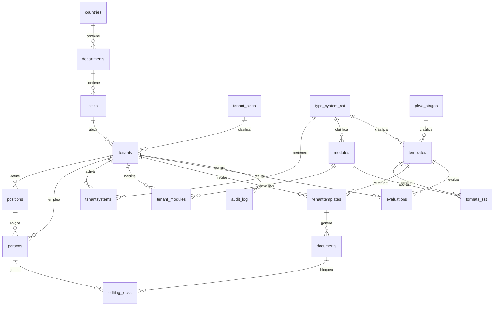

# Sistema de gestión SST y PESV — PostgreSQL

Base de datos relacional desarrollada en **PostgreSQL** para soportar una plataforma multi-tenant orientada a la gestión de **Seguridad y Salud en el Trabajo (SST)** y **Plan Estratégico de Seguridad Vial (PESV)**.

El proyecto fue desarrollado como parte del proyecto académico de bases de datos y aplica conceptos de modelado relacional, normalización, SQL, integridad referencial y programación en PostgreSQL.

---

## 📌 Objetivo

Diseñar e implementar una base de datos que permita administrar información de múltiples organizaciones dentro de una misma base de datos, manteniendo la separación lógica de sus datos mediante un modelo **multi-tenant**.

El sistema permite gestionar:

* Organizaciones.
* Personas y cargos.
* Sistemas SST y PESV.
* Módulos.
* Etapas PHVA.
* Plantillas y formatos.
* Documentos.
* Evaluaciones.
* Ubicación geográfica.
* Bloqueos de edición.
* Auditoría.
* Indicadores y seguimiento documental.

---

## 🏗️ Arquitectura multi-tenant

El proyecto utiliza un esquema compartido (*shared schema*), donde diferentes organizaciones utilizan las mismas tablas.

La separación lógica se realiza principalmente mediante `tenant_id`.

Las entidades que pertenecen directamente a una organización utilizan este identificador, mientras que los catálogos globales, como países, ciudades, módulos y etapas PHVA, son compartidos.

Para garantizar la integridad entre organizaciones se utilizan, cuando es necesario, **claves foráneas compuestas que incluyen `tenant_id`**.

---

## 🧩 Modelo de datos

### Modelo lógico

El modelo lógico define las entidades, atributos, claves candidatas, relaciones, reglas de integridad y normalización.

El documento completo se encuentra en:

`docs/01_modelo_datos.md`

### Diagrama entidad-relación



El diagrama físico detallado con atributos, tipos y claves se encuentra en `docs/01_modelo_datos.md`.

---

## 📐 Normalización

El modelo se encuentra diseñado hasta **BCNF (Boyce-Codd Normal Form)**.

Se aplican principalmente:

* **1FN:** atributos atómicos y ausencia de grupos repetitivos.
* **2FN:** eliminación de dependencias parciales.
* **3FN:** eliminación de dependencias transitivas.
* **BCNF:** toda dependencia funcional no trivial tiene como determinante una superclave.

También se evita almacenar información derivada cuando puede calcularse mediante relaciones existentes.

La justificación detallada de la normalización se encuentra en `docs/01_modelo_datos.md`.

---

## 🗂️ Estructura del proyecto

```text
examen/
│
├── docs/
│   └── 01_modelo_datos.md
│
├── sql/
│   ├── 01_schema.sql
│   ├── 02_datos_prueba.sql
│   ├── 03_consultas_basicas.sql
│   ├── 04_consultas_intermedias.sql
│   ├── 05_vistas.sql
│   ├── 06_consultas_avanzadas.sql
│   ├── 07_procedimientos.sql
│   ├── 08_funciones.sql
│   ├── 09_triggers.sql
│   └── 10_indices.sql
│
└── README.md
```

> `02_datos_prueba.sql` corresponde a la carga de datos de prueba y puede incorporarse posteriormente al repositorio.

---

## 🚀 Ejecución

El proyecto está diseñado para ejecutarse en **PostgreSQL**.

### 1. Crear la base de datos

Desde PostgreSQL:

```sql
CREATE DATABASE sst_pesv;
```

Conectarse posteriormente a la base de datos:

```sql
\c sst_pesv
```

### 2. Ejecutar el esquema

Ejecutar primero:

```text
sql/01_schema.sql
```

Este archivo crea las tablas, claves, restricciones y relaciones principales.

### 3. Insertar datos de prueba

Después del esquema:

```text
sql/02_datos_prueba.sql
```

Este archivo contiene los datos necesarios para probar las consultas y funcionalidades del proyecto.

### 4. Ejecutar las consultas y funcionalidades

Los demás archivos pueden ejecutarse después de crear el esquema y cargar los datos:

```text
03_consultas_basicas.sql
04_consultas_intermedias.sql
05_vistas.sql
06_consultas_avanzadas.sql
07_procedimientos.sql
08_funciones.sql
09_triggers.sql
10_indices.sql
```

---

## 🔎 Consultas SQL

El proyecto contiene tres niveles de consultas.

### Consultas básicas

Incluyen:

* `SELECT`
* `WHERE`
* `ORDER BY`
* `DISTINCT`
* `LIKE`
* `IN`
* `BETWEEN`
* `IS NULL`
* funciones básicas
* `LIMIT`

### Consultas intermedias

Incluyen:

* `INNER JOIN`
* `LEFT JOIN`
* `GROUP BY`
* `HAVING`
* funciones de agregación
* expresiones condicionales
* relaciones entre múltiples tablas

### Consultas avanzadas

Incluyen:

* Subconsultas.
* CTE (`WITH`).
* Funciones de ventana.
* Agregaciones condicionales.
* Análisis de cumplimiento.
* Comparaciones con promedios.
* Rankings.
* Indicadores por organización.
* Análisis de etapas PHVA.

---

## 👁️ Vistas y vistas materializadas

El proyecto implementa vistas para simplificar consultas frecuentes y consolidar información relacionada.

También se utiliza una **vista materializada** para concentrar información documental y de cumplimiento por organización.

Se contempla su actualización mediante:

```sql
REFRESH MATERIALIZED VIEW
```

---

## ⚙️ Procedimientos almacenados

Los procedimientos están implementados mediante **PL/pgSQL** y permiten automatizar operaciones como:

* Registro de organizaciones.
* Registro de personas.
* Cambio de estados.
* Asignación de módulos.
* Habilitación de sistemas.
* Asignación de plantillas.
* Cambio de cargos.
* Traslado de personas.
* Gestión de módulos.
* Cálculo de plantillas.
* Cálculo de cumplimiento.
* Manejo de excepciones.

---

## 🧮 Funciones

El proyecto implementa funciones para obtener información calculada y reutilizable, incluyendo:

* Cantidad de personas por organización.
* Porcentaje de cumplimiento.
* Verificación de módulos habilitados.
* Nombre completo de personas.
* Cantidad de plantillas por etapa PHVA.
* Módulos habilitados.
* Personas y cargos de una organización.
* Clasificación del nivel de cumplimiento.

---

## 🔐 Triggers

Los triggers permiten automatizar reglas de integridad, actualización y auditoría.

Entre sus funciones se encuentran:

* Actualización automática de `updated_at`.
* Validación del estado de organizaciones.
* Validación de asignaciones.
* Control de relaciones entre personas y cargos.
* Control de plantillas.
* Validaciones de cumplimiento.
* Auditoría de modificaciones.
* Control de bloqueos de edición.

---

## ⚡ Índices

Se incluyen índices orientados a mejorar el rendimiento de las consultas utilizadas con mayor frecuencia.

También se incluyen consultas para analizar el comportamiento de los índices mediante `EXPLAIN`.

---

## 🛡️ Integridad de datos

El modelo utiliza diferentes mecanismos de integridad:

* `PRIMARY KEY`
* `FOREIGN KEY`
* `UNIQUE`
* `CHECK`
* `NOT NULL`
* Claves foráneas compuestas.
* Triggers de validación.
* Borrado lógico mediante estados activos/inactivos.

---

## 🏢 Entidades principales

| Entidad           | Descripción                               |
| ----------------- | ----------------------------------------- |
| `tenants`         | Organizaciones clientes                   |
| `persons`         | Personas asociadas a organizaciones       |
| `positions`       | Cargos de las organizaciones              |
| `tenant_sizes`    | Tamaños empresariales                     |
| `type_system_sst` | Sistemas SST/PESV                         |
| `modules`         | Módulos funcionales                       |
| `phva_stages`     | Etapas Planear, Hacer, Verificar y Actuar |
| `templates`       | Plantillas documentales                   |
| `formats_sst`     | Formatos asociados                        |
| `tenanttemplates` | Plantillas asignadas a organizaciones     |
| `documents`       | Documentos generados                      |
| `evaluations`     | Evaluaciones                              |
| `editing_locks`   | Bloqueos de edición                       |
| `audit_log`       | Registro de auditoría                     |
| `countries`       | Países                                    |
| `departments`     | Departamentos o regiones                  |
| `cities`          | Municipios o ciudades                     |

---

## 📚 Documentación

La documentación principal del modelo se encuentra en:

`docs/01_modelo_datos.md`

Este documento contiene:

* Modelo lógico.
* Entidades y atributos.
* Claves primarias y candidatas.
* Relaciones.
* Cardinalidades.
* Reglas de integridad.
* Estrategia multi-tenant.
* Normalización.
* Justificación de BCNF.
* Supuestos del modelo.

---

## 🎓 Proyecto académico

Este proyecto tiene como finalidad aplicar conocimientos de:

* Modelado de bases de datos.
* Normalización.
* PostgreSQL.
* SQL.
* Integridad referencial.
* Consultas relacionales.
* Vistas.
* PL/pgSQL.
* Procedimientos.
* Funciones.
* Triggers.
* Índices.
* Auditoría.
* Arquitectura multi-tenant.

---

## 🛠️ Tecnologías

* **PostgreSQL**
* **SQL**
* **PL/pgSQL**
* **Mermaid**
* **Git / GitHub**
