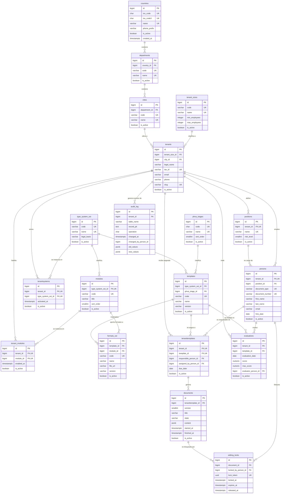

# 01 — Modelo lógico de datos

Plataforma multi-tenant de gestión **SST** (Seguridad y Salud en el Trabajo) y **PESV** (Plan Estratégico de Seguridad Vial) sobre PostgreSQL, con esquema compartido (*shared schema*): todas las empresas clientes conviven en la misma base de datos y sus datos se separan **lógicamente** mediante `tenant_id`.

Este documento describe **únicamente el modelo lógico** (entidades, atributos, claves, restricciones, reglas de integridad, normalización BCNF y supuestos). **No contiene SQL ni DDL**; su implementación física se documentará en un documento posterior (`docs/02_...`).

---

## 1. Objetivo y alcance

| # | Requisito | Dónde se cubre |
|---|---|---|
| R1 | Separación multi-tenant con integridad entre persona y su cargo | §3, §12 |
| R2 | Normalización hasta BCNF con justificación por tabla | §13 |
| R3 | Diagrama Mermaid con relaciones y cardinalidades | §11 |
| R4 | Contactar (nombre, correo, teléfono), identificar, ubicar (municipio → departamento → país), y asignar tamaño, módulos, sistemas y plantillas a una organización | `tenants` (§5.1), `tenant_sizes`, `countries`/`departments`/`cities`, `tenant_modules`, `tenantsystems`, `tenanttemplates` |
| R5 | Supuestos del modelo | §16 |

Fuera de alcance: usuarios/autenticación, notificaciones, historia clínica ocupacional, accidentes, matriz de peligros y cualquier entidad distinta de las listadas en §4–§10.

---

## 2. Convenciones del modelo

1. **Nombres**: identificadores en `snake_case`, singulares para catálogos con nombre propio del dominio y plural para entidades de negocio, respetando los nombres exigidos por el proyecto (`tenants`, `tenant_sizes`, `type_system_sst`, `tenanttemplates`, `formats_sst`, …).
2. **Clave primaria**: en todas las tablas transaccionales y de catálogo se usa una clave primaria **surrogate** `id bigint` generada por identidad, porque las claves naturales (documento, NIT, código) son reutilizables, cambian o no son únicas globalmente.
3. **Claves candidatas**: se declaran además las claves naturales mediante `UNIQUE`, y cuando son necesarias para integridad referencial compuesta se declara `UNIQUE (id, <discriminante>)`.
4. **Fechas y horas**: `timestamptz` (zona horaria explícita; el sistema opera en varias zonas). Las fechas de calendario (nacimiento, ingreso) son `date`.
5. **Campos de control** (presentes salvo excepción justificada):
   - `is_active boolean NOT NULL DEFAULT true` → estado activo/inactivo (borrado lógico). Permite desactivar sin perder historia ni romper FK.
   - `created_at timestamptz NOT NULL DEFAULT now()`.
   - `updated_at timestamptz NOT NULL DEFAULT now()`, obligado a cambiar en cada `UPDATE`.
   - Se documenta en cada tabla cuándo **no aplican** (p. ej. `audit_log`, que es inmutable y solo tiene marca de ocurrencia).
6. **Estados versus flags**: `is_active` es *existencia lógica*; el estado de negocio se modela aparte (`documents.state`, §9.1).
7. **Sin datos derivados**: no se almacena lo que se puede calcular sin ambigüedad (país/departamento de la empresa, porcentaje de cumplimiento). Esto evita dependencias transitivas y anomalías de actualización (§13).
8. **Nulos**: `NOT NULL` es la opción por defecto; solo son nulos los atributos que dependen de un estado o de un dato opcional del negocio, y siempre con la interpretación documentada.

---

## 3. Estrategia multi-tenant (Regla 1)

### 3.1 Regla de asignación de `tenant_id`

> **Una tabla lleva `tenant_id` si y solo si `tenant_id` es parte de su clave candidata**, es decir, si la identidad de sus filas es *propiedad* de la empresa (dos empresas pueden tener filas con la misma clave natural parcial, y la fila no existe fuera de su empresa).

| Categoría | Tablas | ¿Llevan `tenant_id`? | Motivo |
|---|---|---|---|
| Catálogos globales | `countries`, `departments`, `cities`, `tenant_sizes`, `modules`, `phva_stages`, `type_system_sst`, `templates`, `formats_sst` | **No** | Datos maestros compartidos por todas las empresas; son de solo lectura para el tenant |
| Propiedad de la empresa | `positions`, `persons`, `tenantsystems`, `tenant_modules`, `tenanttemplates`, `evaluations` | **Sí** (participa en la clave candidata) | La identidad es local a la empresa: `{tenant_id, nombre}`, `{tenant_id, tipo_documento, número}`, `{tenant_id, system}`, `{tenant_id, module}`, `{tenant_id, template}`, `{tenant_id, template, fecha}`, etc. |
| Derivadas de una asignación | `documents`, `editing_locks` | **No** | El tenant se hereda del padre único (`tenanttemplates` → `tenants`). duplicarlo produciría una dependencia funcional transitiva (violación de BCNF, ver §13.12 y §13.14) |
| Trazabilidad transversal | `audit_log` | **Sí, opcional** (`tenant_id NULL`) | Registra eventos de cualquier empresa, incluidos los del catálogo global (`tenant_id` nulo) |

`tenants` es la raíz: es a la vez la tabla de empresas **y** el registro que las identifica, contacta y ubica (§5.1).

### 3.2 Cómo se garantiza que una persona y su cargo sean de la misma empresa

Se usa la técnica de **clave foránea compuesta con el discriminante de tenant** (*tenant-safe composite foreign key*), que es declarativa y no requiere triggers:

1. `positions` declara `UNIQUE (id, tenant_id)` — redundante lógicamente (el `id` ya es único) pero necesaria como destino de FK compuesta.
2. `persons.position_id` **no** es una FK simple a `positions(id)`. La FK es compuesta:

   `persons (position_id, tenant_id) → positions (id, tenant_id)`

   Como `persons.tenant_id` es NOT NULL y a la vez parte de la FK, **es imposible** que una persona quede apuntando al cargo de otra empresa: PostgreSQL exigiría que exista el par `(position_id, tenant_id)` en `positions`, y ese par solo existe si el cargo fue creado con ese mismo `tenant_id`.
3. La misma técnica se replica en todas las referencias cruzadas dentro de una empresa:
   - `tenanttemplates (assigned_by_person_id, tenant_id) → persons (id, tenant_id)`
   - `tenanttemplates (responsible_person_id, tenant_id) → persons (id, tenant_id)`
   - `evaluations (evaluator_person_id, tenant_id) → persons (id, tenant_id)`
4. `persons.document_number` **no** es globalmente único: la misma persona natural puede figurar en varias empresas (multi-empleo). El `UNIQUE` es `(tenant_id, document_type, document_number)`.
5. Todo lo que cuelga de la persona/empresa lo hace a través de cadenas de un único padre, de modo que no exista ambigüedad de tenant: `tenants → tenanttemplates → documents`, `tenants → positions/persons`.

### 3.3 Aislamiento en tiempo de ejecución

El aislamiento entre empresas en ejecución (Row Level Security, roles de aplicación) y el manejo operativo de `audit_log` no forman parte del modelo lógico: se listan como mejoras opcionales de implementación en §17.

---

## 4. Catálogos globales

Compartidos por todas las empresas, sin `tenant_id`. Son datos de referencia administrados por el equipo de la plataforma.

### 4.1 `countries`

**Propósito.** Catálogo de países que soporta la ubicación geográfica y la validación de datos de contacto (prefijo telefónico).

- **Clave primaria:** `id`.
- **UNIQUE:** `iso_code` (ISO 3166-1 alfa-2), `iso_code3` (alfa-3), `name`.
- **FK:** ninguna.
- **Control:** `is_active`, `created_at`, `updated_at`.

| Atributo | Tipo lógico | Nulo | Restricción / significado |
|---|---|---|---|
| `id` | bigint | No | PK, identidad |
| `iso_code` | char(2) | No | UNIQUE, ISO alpha-2 (`CO`) |
| `iso_code3` | char(3) | No | UNIQUE, ISO alpha-3 (`COL`) |
| `name` | varchar(120) | No | UNIQUE, nombre oficial en español |
| `phone_prefix` | varchar(8) | No | Prefijo telefónico (`+57`) |
| `is_active` | boolean | No | default `true` |
| `created_at` | timestamptz | No | default `now()` |
| `updated_at` | timestamptz | No | default `now()` |

### 4.2 `departments`

**Propósito.** División administrativa de primer nivel dentro de un país (departamento/estado/región).

- **Clave primaria:** `id`.
- **UNIQUE:** `(country_id, code)`, `(country_id, name)`, `(id, country_id)` (destino de FK compuesta).
- **FK:** `country_id → countries(id)`.
- **Control:** `is_active`, `created_at`, `updated_at`.

| Atributo | Tipo lógico | Nulo | Restricción / significado |
|---|---|---|---|
| `id` | bigint | No | PK |
| `country_id` | bigint | No | FK → `countries` |
| `code` | varchar(10) | No | Código oficial (DANE para Colombia) |
| `name` | varchar(150) | No | Nombre oficial |
| `is_active` | boolean | No | default `true` |
| `created_at` / `updated_at` | timestamptz | No | Control |

### 4.3 `cities`

**Propósito.** Municipio/ciudad. Es el nivel geográfico que se asigna a la empresa (requisito R4: municipio, departamento y país se obtienen por navegación, no por duplicación).

- **Clave primaria:** `id`.
- **UNIQUE:** `(department_id, code)`, `(department_id, name)`.
- **FK:** `department_id → departments(id)`.
- **Control:** `is_active`, `created_at`, `updated_at`.

| Atributo | Tipo lógico | Nulo | Restricción / significado |
|---|---|---|---|
| `id` | bigint | No | PK |
| `department_id` | bigint | No | FK → `departments` |
| `code` | varchar(10) | No | Código oficial del municipio |
| `name` | varchar(150) | No | Nombre oficial |
| `is_active` | boolean | No | default `true` |
| `created_at` / `updated_at` | timestamptz | No | Control |

### 4.4 `tenant_sizes`

**Propósito.** Clasificación de tamaño de la empresa (micro, pequeña, mediana, grande) según el número de trabajadores; determina obligaciones diferenciales de SST/PESV.

- **Clave primaria:** `id`.
- **UNIQUE:** `code`, `name`.
- **FK:** ninguna.
- **Control:** `is_active`, `created_at`, `updated_at`.

| Atributo | Tipo lógico | Nulo | Restricción / significado |
|---|---|---|---|
| `id` | bigint | No | PK |
| `code` | varchar(20) | No | UNIQUE (`MICRO`, `PEQUENA`, `MEDIANA`, `GRANDE`) |
| `name` | varchar(80) | No | UNIQUE |
| `min_employees` | integer | No | Límite inferior inclusivo, `>= 1` |
| `max_employees` | integer | Sí | Límite superior inclusivo; nulo = rango abierto (sin tope) |
| `description` | text | Sí | Criterio normativo del rango |
| `sort_order` | smallint | No | Orden de presentación |
| `is_active` / `created_at` / `updated_at` | — | No | Control |

**Restricción de integridad:** `max_employees` nulo o `>= min_employees`; los rangos no deben solaparse (regla de negocio verificada en mantenimiento del catálogo).

### 4.5 `modules`

**Propósito.** Catálogo de módulos funcionales de la plataforma (p. ej. peligros, accidentalidad, EPP, inspecciones, planes de acción), clasificado por el tipo de sistema de gestión al que pertenecen.

- **Clave primaria:** `id`.
- **UNIQUE:** `(type_system_sst_id, code)`.
- **FK:** `type_system_sst_id → type_system_sst(id)`.
- **Control:** `is_active`, `created_at`, `updated_at`.

| Atributo | Tipo lógico | Nulo | Restricción / significado |
|---|---|---|---|
| `id` | bigint | No | PK |
| `type_system_sst_id` | bigint | No | FK → `type_system_sst`; sistema al que pertenece el módulo |
| `code` | varchar(40) | No | Identificador estable; único por sistema |
| `title` | varchar(120) | No | Título visible del módulo |
| `description` | text | Sí | Alcance del módulo |
| `sort_order` | smallint | No | Orden en menú, default `0` |
| `is_active` / `created_at` / `updated_at` | — | No | Control |

### 4.6 `type_system_sst`

**Propósito.** Tipos de sistema de gestión que la plataforma gestiona: **SST** y **PESV**. Es el eje que organiza módulos y plantillas.

- **Clave primaria:** `id`.
- **UNIQUE:** `code`, `name`.
- **FK:** ninguna.
- **Control:** `is_active`, `created_at`, `updated_at`.

| Atributo | Tipo lógico | Nulo | Restricción / significado |
|---|---|---|---|
| `id` | bigint | No | PK |
| `code` | varchar(20) | No | UNIQUE (`SST`, `PESV`) |
| `name` | varchar(120) | No | UNIQUE |
| `description` | text | Sí | Alcance del sistema |
| `legal_basis` | varchar(300) | Sí | Normativa aplicable (p. ej. Decreto 1072 de 2015) |
| `is_active` / `created_at` / `updated_at` | — | No | Control |

### 4.7 `phva_stages`

**Propósito.** Fases del ciclo PHVA (**P**lanear, **H**acer, **V**erificar, **A**ctuar) con las que se clasifican las plantillas y se agrupan los indicadores.

- **Clave primaria:** `id`.
- **UNIQUE:** `code`, `name`.
- **FK:** ninguna.
- **Control:** `is_active`, `created_at`, `updated_at`.

| Atributo | Tipo lógico | Nulo | Restricción / significado |
|---|---|---|---|
| `id` | bigint | No | PK |
| `code` | char(1) | No | UNIQUE (`P`, `H`, `V`, `A`) |
| `name` | varchar(40) | No | UNIQUE (`Planear`, `Hacer`, `Verificar`, `Actuar`) |
| `description` | text | Sí | Qué se espera en la fase |
| `sort_order` | smallint | No | Orden del ciclo |
| `is_active` / `created_at` / `updated_at` | — | No | Control |

---

## 5. Núcleo organizacional

### 5.1 `tenants` (empresas / organizaciones cliente)

**Propósito.** Registrar cada organización cliente de la plataforma, poder **contactarla**, **identificarla de forma única**, **ubicarla geográficamente** y **clasificarla por tamaño**.

- **Clave primaria:** `id`.
- **UNIQUE:** `tax_id` (identificación fiscal única de la organización), `(id, city_id)` (destino de FK compuesta de verificación geográfica, opcional).
- **FK:** `tenant_size_id → tenant_sizes(id)`, `city_id → cities(id)`.
- **Control:** `is_active`, `created_at`, `updated_at`.
- **No almacena** `country_id` ni `department_id`: son dependencias transitivas de `city_id` (§13.4).

| Atributo | Tipo lógico | Nulo | Restricción / significado |
|---|---|---|---|
| `id` | bigint | No | PK |
| `tenant_size_id` | bigint | No | FK → `tenant_sizes` (tamaño) |
| `city_id` | bigint | No | FK → `cities` (municipio; de aquí se derivan departamento y país) |
| `legal_name` | varchar(200) | No | Razón social (nombre para contactar) |
| `trade_name` | varchar(200) | Sí | Nombre comercial |
| `tax_id` | varchar(30) | No | UNIQUE. NIT / RUC / CIF sin dígito de verificación separado |
| `check_digit` | char(1) | Sí | Dígito de verificación (aplica en Colombia) |
| `email` | varchar(160) | No | **Correo de contacto** corporativo |
| `phone` | varchar(30) | No | **Teléfono** de contacto principal |
| `address` | varchar(200) | Sí | Dirección física |
| `contact_name` | varchar(160) | Sí | Persona responsable de la relación con la plataforma |
| `contact_email` | varchar(160) | Sí | Correo alterno del responsable |
| `slug` | varchar(60) | No | UNIQUE. Identificador legible para URL/subdominio |
| `is_active` | boolean | No | default `true` (empresa activa en la plataforma) |
| `created_at` / `updated_at` | timestamptz | No | Control |

**Reglas:** `email` debe tener formato de correo (CHECK de patrón); `tax_id` único global; una empresa inactiva conserva todas sus filas históricas.

### 5.2 `positions` (cargos)

**Propósito.** Catálogo **por empresa** de cargos ocupados por las personas, con su nivel de riesgo asociado.

- **Clave primaria:** `id`.
- **UNIQUE:** `(tenant_id, name)`, `(id, tenant_id)` (destino de FK compuesta).
- **FK:** `tenant_id → tenants(id)`.
- **Control:** `is_active`, `created_at`, `updated_at`.

| Atributo | Tipo lógico | Nulo | Restricción / significado |
|---|---|---|---|
| `id` | bigint | No | PK |
| `tenant_id` | bigint | No | FK → `tenants`; **parte de la clave candidata** |
| `name` | varchar(160) | No | Nombre del cargo, único dentro de la empresa |
| `code` | varchar(20) | Sí | Código interno del cargo (opcional) |
| `risk_level` | smallint | No | Nivel de riesgo I–V; CHECK `between 1 and 5` |
| `description` | text | Sí | Funciones y exposición |
| `is_active` | boolean | No | default `true` (cargo vigente) |
| `created_at` / `updated_at` | timestamptz | No | Control |

### 5.3 `persons` (personas / trabajadores)

**Propósito.** Registrar las personas vinculadas a cada empresa, con su identificación, datos de contacto, cargo y fechas laborales.

- **Clave primaria:** `id`.
- **UNIQUE:** `(tenant_id, document_type, document_number)`, `(tenant_id, email)` (índice único parcial, solo cuando `email` no es nulo), `(id, tenant_id)` (destino de FK compuesta).
- **FK:** `tenant_id → tenants(id)`; **FK compuesta** `(position_id, tenant_id) → positions(id, tenant_id)`.
- **Control:** `is_active`, `created_at`, `updated_at`.

| Atributo | Tipo lógico | Nulo | Restricción / significado |
|---|---|---|---|
| `id` | bigint | No | PK |
| `tenant_id` | bigint | No | FK → `tenants`; **parte de la clave candidata** |
| `position_id` | bigint | No | **FK compuesta con `tenant_id`** → `positions(id, tenant_id)` |
| `document_type` | varchar(10) | No | CC, CE, TI, PA, PPT, NIT; CHECK contra lista |
| `document_number` | varchar(30) | No | Número sin puntos ni espacios |
| `first_name` | varchar(100) | No | Nombres |
| `last_name` | varchar(100) | No | Apellidos |
| `email` | varchar(160) | Sí | Único por empresa cuando se informa |
| `phone` | varchar(30) | Sí | Contacto telefónico |
| `birth_date` | date | Sí | Fecha de nacimiento |
| `hire_date` | date | No | Fecha de ingreso |
| `termination_date` | date | Sí | Fecha de retiro; CHECK: nula o `>= hire_date` |
| `is_active` | boolean | No | default `true` (vinculación vigente) |
| `created_at` / `updated_at` | timestamptz | No | Control |

---

## 6. Configuración por empresa

### 6.1 `tenantsystems` (sistemas habilitados por empresa)

**Propósito.** Definir qué sistemas de gestión (**SST**, **PESV**) tiene activos cada empresa.

- **Clave primaria:** `id`.
- **UNIQUE:** `(tenant_id, type_system_sst_id)`, `(id, tenant_id)`.
- **FK:** `tenant_id → tenants(id)`, `type_system_sst_id → type_system_sst(id)`.
- **Control:** `is_active` (sistema habilitado/deshabilitado), `created_at`, `updated_at`.

| Atributo | Tipo lógico | Nulo | Restricción / significado |
|---|---|---|---|
| `id` | bigint | No | PK |
| `tenant_id` | bigint | No | FK → `tenants` |
| `type_system_sst_id` | bigint | No | FK → `type_system_sst` |
| `activated_at` | timestamptz | No | default `now()` |
| `deactivated_at` | timestamptz | Sí | Fecha de deshabilitación |
| `notes` | varchar(300) | Sí | Observaciones del contrato alcance/servicio |
| `is_active` | boolean | No | default `true` |
| `created_at` / `updated_at` | timestamptz | No | Control |

### 6.2 `tenant_modules` (módulos habilitados por empresa)

**Propósito.** Habilitar o deshabilitar módulos funcionales por empresa (licenciamiento/alcance).

- **Clave primaria:** `id`.
- **UNIQUE:** `(tenant_id, module_id)`, `(id, tenant_id)`.
- **FK:** `tenant_id → tenants(id)`, `module_id → modules(id)`.
- **Control:** `is_active`, `created_at`, `updated_at`.

| Atributo | Tipo lógico | Nulo | Restricción / significado |
|---|---|---|---|
| `id` | bigint | No | PK |
| `tenant_id` | bigint | No | FK → `tenants` |
| `module_id` | bigint | No | FK → `modules` |
| `enabled_at` | timestamptz | No | default `now()` |
| `disabled_at` | timestamptz | Sí | Fecha de deshabilitación |
| `is_active` | boolean | No | default `true` |
| `created_at` / `updated_at` | timestamptz | No | Control |

---

## 7. Catálogo maestro de plantillas y formatos (global)

### 7.1 `templates`

**Propósito.** Catálogo maestro de plantillas de documentos (planes, programas, actas, matrices), clasificadas por sistema de gestión y por fase PHVA. Las plantillas son **globales**: la asignación a cada empresa vive en `tenanttemplates`.

- **Clave primaria:** `id`.
- **UNIQUE:** `(type_system_sst_id, code, version)`.
- **FK:** `type_system_sst_id → type_system_sst(id)`, `phva_stage_id → phva_stages(id)`.
- **Control:** `is_active`, `created_at`, `updated_at`.

| Atributo | Tipo lógico | Nulo | Restricción / significado |
|---|---|---|---|
| `id` | bigint | No | PK |
| `type_system_sst_id` | bigint | No | FK → `type_system_sst` |
| `phva_stage_id` | bigint | No | FK → `phva_stages` |
| `code` | varchar(30) | No | Código de la plantilla; **puede repetirse entre sistemas y versiones** |
| `name` | varchar(200) | No | Nombre de la plantilla |
| `description` | text | Sí | Objetivo y contenido esperado |
| `version` | varchar(10) | No | default `'1.0'`; versionado del diseño |
| `legal_reference` | varchar(300) | Sí | Requisito normativo que satisface |
| `is_active` | boolean | No | default `true` |
| `created_at` / `updated_at` | timestamptz | No | Control |

### 7.2 `formats_sst`

**Propósito.** Formatos físicos/archivos (PDF, XLSX, DOCX) asociados a una plantilla y a un módulo del mismo sistema. Una plantilla puede tener varios formatos y varias versiones del mismo formato.

- **Clave primaria:** `id`.
- **UNIQUE:** `(template_id, code, version)`.
- **FK:** `template_id → templates(id)`, `module_id → modules(id)`.
- **Control:** `is_active`, `created_at`, `updated_at`.

| Atributo | Tipo lógico | Nulo | Restricción / significado |
|---|---|---|---|
| `id` | bigint | No | PK |
| `template_id` | bigint | No | FK → `templates` |
| `module_id` | bigint | No | FK → `modules`; módulo al que aporta el formato |
| `code` | varchar(30) | No | Código del formato (`F-SST-001`); único por plantilla y versión |
| `name` | varchar(200) | No | Nombre del formato |
| `file_url` | varchar(400) | No | Ruta/URL del archivo en el almacenamiento de objetos |
| `mime_type` | varchar(100) | No | default `'application/pdf'` |
| `checksum` | varchar(64) | Sí | SHA-256 para control de integridad del archivo |
| `version` | varchar(10) | No | Versión del formato |
| `is_active` | boolean | No | default `true` |
| `created_at` / `updated_at` | timestamptz | No | Control |

**Regla de negocio (coherencia de sistema):** el sistema del módulo debe coincidir con el de la plantilla: `modules.type_system_sst_id` (vía `module_id`) = `templates.type_system_sst_id` (vía `template_id`). No es expresable como FK declarativa (compara atributos de dos padres distintos); se verifica con trigger o validación en aplicación (§12.4).

---

## 8. Asignación de plantillas a empresas

### 8.1 `tenanttemplates` (plantilla asignada)

**Propósito.** Vincular una plantilla global con una empresa: **es la asignación** que genera los documentos por diligenciar, define responsables y fecha límite.

- **Clave primaria:** `id`.
- **UNIQUE:** `(tenant_id, template_id)` (una asignación por plantilla y empresa), `(id, tenant_id)` (destino de FK compuesta).
- **FK:** `tenant_id → tenants(id)`, `template_id → templates(id)`,
  **FK compuestas**: `(responsible_person_id, tenant_id) → persons(id, tenant_id)`, `(assigned_by_person_id, tenant_id) → persons(id, tenant_id)`.
- **Control:** `is_active` (asignación vigente), `created_at`, `updated_at`.

| Atributo | Tipo lógico | Nulo | Restricción / significado |
|---|---|---|---|
| `id` | bigint | No | PK |
| `tenant_id` | bigint | No | FK → `tenants` |
| `template_id` | bigint | No | FK → `templates` |
| `assigned_at` | timestamptz | No | default `now()` |
| `due_date` | date | Sí | Fecha límite de entrega |
| `responsible_person_id` | bigint | Sí | FK compuesta con `tenant_id` → persona responsable de diligenciar |
| `assigned_by_person_id` | bigint | Sí | FK compuesta con `tenant_id` → quien asignó |
| `notes` | varchar(300) | Sí | Instrucciones particulares |
| `is_active` | boolean | No | default `true` |
| `created_at` / `updated_at` | timestamptz | No | Control |

---

## 9. Operación: documentos, evaluaciones y bloqueos

### 9.1 `documents` (documentos diligenciados con estado)

**Propósito.** Representar la **instancia diligenciable de cada plantilla asignada** a una empresa, con su estado de avance: **no iniciado**, **borrador** o **finalizado**. Se crea una fila por asignación (estado inicial `no_iniciado`) y se versiona cuando se reabre o renueva.

- **Clave primaria:** `id`.
- **UNIQUE:** `(tenanttemplate_id, version)`.
- **FK:** `tenanttemplate_id → tenanttemplates(id)` (padre único ⇒ el tenant queda determinado).
- **Control:** `is_active` (borrado lógico), `created_at`, `updated_at`. **No** lleva `tenant_id` (§3.1, §13.12).
- **Estado:** dominio `document_state` con valores `'no_iniciado'`, `'borrador'`, `'finalizado'` (CHECK / tipo enumerado).

| Atributo | Tipo lógico | Nulo | Restricción / significado |
|---|---|---|---|
| `id` | bigint | No | PK |
| `tenanttemplate_id` | bigint | No | FK → `tenanttemplates` (plantilla asignada) |
| `version` | smallint | No | default `1`; número de versión del documento |
| `title` | varchar(200) | No | Título del documento (hereda el nombre de la plantilla al crearse) |
| `state` | varchar(20) | No | default `'no_iniciado'`; CHECK en (`no_iniciado`, `borrador`, `finalizado`) |
| `content` | jsonb | Sí | Respuestas del formulario; nulo mientras el estado es `no_iniciado` |
| `file_url` | varchar(400) | Sí | Archivo generado cuando el documento se finaliza |
| `started_at` | timestamptz | Sí | Se fija al pasar a `borrador` |
| `finished_at` | timestamptz | Sí | Se fija al pasar a `finalizado` |
| `is_active` | boolean | No | default `true` |
| `created_at` / `updated_at` | timestamptz | No | Control |

**Reglas de estado (reglas de transición, no dependencias funcionales):**
- `state = 'no_iniciado'` ⇒ `started_at IS NULL AND finished_at IS NULL AND content IS NULL`.
- `state = 'borrador'` ⇒ `started_at IS NOT NULL AND finished_at IS NULL`.
- `state = 'finalizado'` ⇒ `started_at IS NOT NULL AND finished_at IS NOT NULL`.
- `finished_at >= started_at`; una transición solo avanza (`no_iniciado` → `borrador` → `finalizado`), salvo reapertura explícita que **crea una nueva versión**.

### 9.2 `evaluations` (mediciones de cumplimiento)

**Propósito.** Registrar la medición de cumplimiento de una empresa sobre una plantilla (autoevaluación de estándares, verificación PHVA, auditoría interna), con puntaje, resultado y evaluador.

- **Clave primaria:** `id`.
- **UNIQUE:** `(tenant_id, template_id, evaluation_date)` (una evaluación por plantilla y fecha).
- **FK:** `tenant_id → tenants(id)`, `template_id → templates(id)`,
  **FK compuesta** `(evaluator_person_id, tenant_id) → persons(id, tenant_id)`.
- **Control:** `is_active`, `created_at`, `updated_at`.

| Atributo | Tipo lógico | Nulo | Restricción / significado |
|---|---|---|---|
| `id` | bigint | No | PK |
| `tenant_id` | bigint | No | FK → `tenants`; **parte de la clave candidata** |
| `template_id` | bigint | No | FK → `templates` (plantilla evaluada) |
| `evaluation_date` | date | No | Fecha de corte de la medición |
| `score` | numeric(5,2) | Sí | Puntaje obtenido; nulo mientras no se cierra |
| `max_score` | numeric(5,2) | No | default `100`; CHECK `> 0` |
| `evaluator_person_id` | bigint | Sí | FK compuesta con `tenant_id` → quien evalúa |
| `observations` | text | Sí | Hallazgos y plan de acción |
| `is_active` | boolean | No | default `true` |
| `created_at` / `updated_at` | timestamptz | No | Control |

**Restricción:** `score` nulo o entre `0` y `max_score`. **No** se almacena el porcentaje de cumplimiento: es derivado (`score / max_score`), §13.13.
**Decisión de diseño:** la evaluación se ancla en `(tenant_id, template_id)` y no en `tenanttemplates` para no introducir la DF transitiva `tenanttemplate_id → tenant_id` (§13.13 y supuesto S9).

### 9.3 `editing_locks` (bloqueos de edición concurrente)

**Propósito.** Evitar la edición simultánea de un mismo documento por dos usuarios: mientras exista un bloqueo vigente, el documento no puede ser abierto en modo edición por otra persona.

- **Clave primaria:** `id`.
- **UNIQUE:** `(document_id)` **parcial**, aplicado solo a los bloqueos vigentes (`WHERE released_at IS NULL`) → un único bloqueo activo por documento; se conservan los bloqueos históricos.
- **FK:** `document_id → documents(id)`, `locked_by_person_id → persons(id)`.
- **Control:** no aplica `is_active` (el ciclo de vida se expresa con `released_at`); `created_at`, `updated_at`.

| Atributo | Tipo lógico | Nulo | Restricción / significado |
|---|---|---|---|
| `id` | bigint | No | PK |
| `document_id` | bigint | No | FK → `documents` |
| `locked_by_person_id` | bigint | No | FK → `persons` (misma empresa que el documento: regla de §12.3) |
| `lock_token` | uuid | No | UNIQUE. Token entregado al cliente; evita liberar un bloqueo ajeno |
| `locked_at` | timestamptz | No | default `now()` |
| `expires_at` | timestamptz | No | CHECK `> locked_at`. Bloqueo con caducidad (heartbeat) |
| `released_at` | timestamptz | Sí | Nulo = bloqueo vigente; CHECK nulo o `>= locked_at` |
| `created_at` / `updated_at` | timestamptz | No | Control |

---

## 10. Auditoría

### 10.1 `audit_log` (auditoría genérica)

**Propósito.** Registro **genérico, append-only e inmutable** de todo cambio de datos (alta/modificación/baja lógica o física), independiente de la tabla afectada. Sirve para trazabilidad, soporte y requisitos de auditoría SST.

- **Clave primaria:** `id`.
- **UNIQUE:** `request_id` **no** es único (un mismo request puede generar varios registros); alta disponibilidad de índice `(table_name, record_pk)`. No se declaran claves candidatas adicionales: la PK es la única.
- **FK:** `tenant_id → tenants(id)` (**nullable**: los eventos del catálogo global no tienen tenant).
- **Control:** **no aplican** `is_active` ni `updated_at`: un registro de auditoría nunca se modifica ni se desactiva; solo tiene la marca de ocurrencia `occurred_at` (equivalente a `created_at`).

| Atributo | Tipo lógico | Nulo | Restricción / significado |
|---|---|---|---|
| `id` | bigint | No | PK (identidad creciente; orden cronológico) |
| `tenant_id` | bigint | Sí | FK → `tenants`; nulo para eventos de tablas globales |
| `table_name` | varchar(63) | No | Nombre de la tabla afectada |
| `record_pk` | text | No | PK serializada del registro afectado (soporta PK compuestas) |
| `operation` | char(1) | No | `I` insert, `U` update, `D` delete; CHECK |
| `changed_at` | timestamptz | No | default `now()`; marca de ocurrencia |
| `changed_by_person_id` | bigint | Sí | **Referencia lógica sin FK**: un log debe sobrevivir al borrado físico de la persona y no puede bloquear purgas |
| `db_user` | varchar(63) | No | Rol de base de datos que ejecutó la operación |
| `application_name` | varchar(63) | Sí | Origen (backend, migración, consola) |
| `client_addr` | inet | Sí | Dirección del cliente |
| `request_id` | uuid | Sí | Correlación de una misma operación de negocio |
| `changed_columns` | text[] | Sí | Columnas afectadas en un `UPDATE` |
| `old_values` | jsonb | Sí | Snapshot antes del cambio (nulo en `INSERT`) |
| `new_values` | jsonb | Sí | Snapshot después del cambio (nulo en `DELETE`) |
| `extra_context` | jsonb | Sí | Metadatos libres (endpoint, user-agent, motivo del cambio) |

**Reglas:** solo `INSERT` para la aplicación (sin `UPDATE`/`DELETE`); retención según política de la organización. Las columnas `jsonb`/`text[]` son una **desnormalización deliberada** (captura agnóstica al esquema), discutida en §13.15.

---

## 11. Diagrama entidad-relación

Cardinalidades: `||--o{` = uno a muchos (0..N), `||--||` = uno a uno, `}o--o{` = muchos a muchos (siempre resueltos por tabla intermedia).

---

## 12. Reglas de integridad y su mecanismo

### 12.1 Declarables con FK compuesta (preferidas)

| Regla | Mecanismo |
|---|---|
| Una persona solo puede ocupar cargos de su propia empresa | `persons (position_id, tenant_id)` → `positions (id, tenant_id)` |
| El responsable de una plantilla asignada pertenece a la misma empresa | `tenanttemplates (responsible_person_id, tenant_id)` → `persons (id, tenant_id)` |
| Quien asigna y quien evalúa son personas de la empresa | `tenanttemplates (assigned_by_person_id, tenant_id)`, `evaluations (evaluator_person_id, tenant_id)` → `persons (id, tenant_id)` |
| Un documento pertenece a un tenant sin ambigüedad | `documents.tenanttemplate_id` → `tenanttemplates.id` (padre único, el tenant es heredado) |
| Un cargo, persona, asignación, módulo o sistema no puede quedar "huérfano" al inactivar una empresa | FK `ON DELETE RESTRICT`; la baja de empresa es lógica (`is_active = false`) |
| Geografía coherente | `cities.department_id` → `departments.id` → `countries.id`; la empresa se ubica solo por `city_id` |

### 12.2 Reglas de unicidad relevantes

`tenants.tax_id`; `tenants.slug`; `positions (tenant_id, name)`; `persons (tenant_id, document_type, document_number)`; `persons (tenant_id, email)` parcial; `tenanttemplates (tenant_id, template_id)`; `tenant_modules (tenant_id, module_id)`; `tenantsystems (tenant_id, type_system_sst_id)`; `documents (tenanttemplate_id, version)`; `evaluations (tenant_id, template_id, evaluation_date)`; `templates (type_system_sst_id, code, version)`; `formats_sst (template_id, code, version)`; `editing_locks (document_id)` parcial.

### 12.3 Regla cruzada no expresable como FK sin redundancia

> **`editing_locks` debe referenciar un `document` y una `person` de la misma empresa.**

El documento hereda el tenant de `tenanttemplates` y la persona lo tiene explícito; como `editing_locks` no lleva `tenant_id` (hacerlo introduciría la DF `document_id → tenant_id` y rompería BCNF, §13.14), la regla se verifica con un **trigger de validación diferido a fin de sentencia** en la implementación física: `exists (person with same tenant as document)`.

Alternativa considerada y descartada en el modelo lógico: añadir `tenant_id` a `documents` y `editing_locks` junto con FK compuestas. Es la variante habitual de rendimiento (RLS sin join), pero degrada la normalización (2NF/BCNF) y se documenta como variante física opcional en §16 (S15), no como modelo base.

### 12.4 Reglas de negocio adicionales (verificación en aplicación o trigger)

- El sistema del módulo de un formato debe coincidir con el de su plantilla: `modules.type_system_sst_id` (vía `formats_sst.module_id`) = `templates.type_system_sst_id` (vía `formats_sst.template_id`).
- No se solapan los rangos de `tenant_sizes`.
- Un documento solo puede editarse si no hay un `editing_lock` vigente de otra persona (`released_at IS NULL AND expires_at > now()`).
- No se puede asignar (`tenanttemplates`) una plantilla de un sistema de gestión que la empresa no tenga activo en `tenantsystems`.
- Al `finalizar` un documento el `content` es obligatorio; al reabrir se crea una nueva `version`.

---

## 13. Normalización y BCNF (Regla 2)

### 13.0 Método y criterios generales

- **1FN**: todos los atributos son atómicos, no hay grupos repetidos ni columnas multivaluadas. Los "arreglos" solo aparecen en `audit_log` (`changed_columns`, `jsonb`) y se justifican en §13.15.
- **2FN**: no hay dependencias parciales: las claves candidatas compuestas son todas de la forma `(surrogate o global, tenant_id, atributo de negocio)`, y ningún atributo no primo depende de una parte de la clave. Esto se logra porque **`tenant_id` solo se almacena cuando es parte de la clave candidata** (§3.1); almacenarlo en tablas derivadas produciría justamente una dependencia parcial (`document_id → tenant_id`) — el caso clásico que aquí se evita.
- **3FN**: no hay dependencias transitivas. Por eso `tenants` **no** guarda `department_id` ni `country_id` (dependen de `city_id`) y `evaluations` no guarda porcentaje de cumplimiento (depende de `score` y `max_score`).
- **BCNF**: en cada tabla, toda dependencia funcional no trivial tiene como determinante una **superclave** (en la práctica, una clave candidata).
- Notación: `X → Y` dependencia funcional; `*` = todos los atributos restantes; `CK` = clave candidata; `PK` = clave primaria.

### 13.1 `countries`
- **CK:** `id`; `iso_code`; `iso_code3`; `name`.
- **DF:** `id → *`; `iso_code → *`; `iso_code3 → *`; `name → *`; además `iso_code ↔ iso_code3 ↔ name` (todas mutuamente determinantes por ser claves).
- **BCNF:** toda determinante es una clave candidata. ✅

### 13.2 `departments`
- **CK:** `{id}`; `{country_id, code}`; `{country_id, name}`; `{id, country_id}` es superclave (contiene `id`).
- **DF:** `id → *`; `{country_id, code} → *`; `{country_id, name} → *`.
- **BCNF:** las tres determinantes son CK. ✅ (No se declara `code` único global porque dos países pueden repetir códigos.)

### 13.3 `cities`
- **CK:** `{id}`; `{department_id, code}`; `{department_id, name}`.
- **DF:** `id → *`; `{department_id, code} → *`; `{department_id, name} → *`.
- **BCNF:** ✅ (mismo razonamiento que `departments`).

### 13.4 `tenants`
- **CK:** `{id}`; `{tax_id}`; `{slug}`.
- **DF:** `id → *`; `tax_id → *`; `slug → *`.
- **DF prohibidas (justificación de 3FN):** `city_id → department_id` y `department_id → country_id` existirían si se copiaran esos atributos; al no almacenarse, no hay transitividad.
- **BCNF:** todas las determinantes son CK. ✅

### 13.5 `tenant_sizes`
- **CK:** `{id}`; `{code}`; `{name}`.
- **DF:** `id → *`; `code → *`; `name → *`. (`min_employees`/`max_employees` no determinan nada: varios rangos comparten límites.)
- **BCNF:** ✅

### 13.6 `type_system_sst`, `phva_stages` y `modules`
- `type_system_sst` y `phva_stages` — **CK:** `{id}`; `{code}`; `{name}` (`phva_stages` incluye `sort_order` como atributo no determinante).
  **DF:** `id → *`; `code → *`; `name → *`.
- `modules` — **CK:** `{id}`; `{type_system_sst_id, code}`.
  **DF:** `id → *`; `{type_system_sst_id, code} → *`.
  **DF evitada:** `code → title` no se admite: `code` no es único global (puede repetirse entre SST y PESV), por eso la clave incluye el sistema; `title` puede repetirse y no determina nada.
- **BCNF:** ✅ en las tres: toda determinante es clave candidata.

### 13.7 `positions`
- **CK:** `{id}`; `{tenant_id, name}`.
- **DF:** `id → *`; `{tenant_id, name} → *`.
- **DF evitada:** `name → risk_level` (si existiera un catálogo global de nombres de cargo); aquí `name` es local a la empresa, y una empresa podría tener dos cargos homónimos solo si se permitiera — el `UNIQUE (tenant_id, name)` lo prohíbe, dejando `{tenant_id, name}` como clave.
- **BCNF:** ✅

### 13.8 `persons`
- **CK:** `{id}`; `{tenant_id, document_type, document_number}`; `{tenant_id, email}` (parcial: solo cuando `email` no es nulo).
- **DF:** `id → *`; `{tenant_id, document_type, document_number} → *`; `{tenant_id, email} → *`.
- **DF:** `position_id → *` **no** se cumple (muchas personas comparten cargo) ⇒ no hay dependencia de atributo no clave.
- **DF evitada:** `document_number → first_name, last_name` (sería cierta en el mundo real si la persona existiera una sola vez; se evita **no** declarando `document_number` como único global, porque una persona puede estar vinculada a varias empresas).
- **BCNF:** todas las determinantes son CK. ✅

### 13.9 `tenantsystems`
- **CK:** `{id}`; `{tenant_id, type_system_sst_id}`.
- **DF:** `id → *`; `{tenant_id, type_system_sst_id} → *`.
- **BCNF:** ✅

### 13.10 `tenant_modules`
- **CK:** `{id}`; `{tenant_id, module_id}`.
- **DF:** `id → *`; `{tenant_id, module_id} → *`.
- **BCNF:** ✅

### 13.11 `templates` y `formats_sst`
- `templates` — **CK:** `{id}`; `{type_system_sst_id, code, version}`.
  **DF:** `id → *`; `{type_system_sst_id, code, version} → *`.
  **DF evitada:** `code → name, phva_stage_id` no se admite: `code` no es único global (puede repetirse entre SST y PESV y entre versiones), por eso la clave incluye `type_system_sst_id` y `version`. ✅
- `formats_sst` — **CK:** `{id}`; `{template_id, code, version}`.
  **DF:** `id → *`; `{template_id, code, version} → *`.
  **DF evitada:** `template_id → file_url, code` (sería un formato único por plantilla: no es el caso, una plantilla tiene varios formatos y versiones); `module_id` no determina nada (un módulo aporta formatos a varias plantillas) y la coherencia de sistema con la plantilla es regla de negocio (§12.4), no una DF almacenada. ✅

### 13.12 `tenanttemplates`
- **CK:** `{id}`; `{tenant_id, template_id}`.
- **DF:** `id → *`; `{tenant_id, template_id} → *`.
- **DF:** `responsible_person_id → *` no se cumple (una persona responde por muchas asignaciones); `template_id → tenant_id` tampoco (una plantilla global se asigna a muchas empresas).
- **BCNF:** ✅ (Nota: al ser `templates` global, `template_id` **no** determina el tenant, y por eso esta tabla sí puede llevar `tenant_id` sin violar BCNF.)

### 13.13 `documents`
- **CK:** `{id}`; `{tenanttemplate_id, version}`.
- **DF:** `id → *`; `{tenanttemplate_id, version} → *`.
- **DF evitadas:** `tenanttemplate_id → tenant_id` (por eso **no** se guarda `tenant_id`: sería dependencia parcial/transitiva); `state → started_at, finished_at` (las reglas de estado son restricciones de dominio, no dependencias funcionales, porque `state` no determina el valor exacto de las marcas de tiempo); `content → title` (tampoco se cumple).
- **BCNF:** ✅ — y esta es la razón formal por la que el tenant se hereda vía `tenanttemplates` (§3.1).

### 13.14 `evaluations`
- **CK:** `{id}`; `{tenant_id, template_id, evaluation_date}`.
- **DF:** `id → *`; `{tenant_id, template_id, evaluation_date} → *`.
- **DF evitadas:** `template_id → tenant_id` (no se cumple: plantilla global); `score, max_score → porcentaje` se evita **no almacenando** el porcentaje. `evaluator_person_id` no determina nada.
- **Decisión:** anclar en `tenant_id + template_id` en lugar de `tenanttemplate_id` evita la DF `tenanttemplate_id → tenant_id`, que sería una DF con determinante no superclave (**violación de BCNF**). Si la asignación fuese la clave, la tabla dejaría de cumplir BCNF o exigiría quitar `tenant_id` y perder la FK compuesta del evaluador (§16, S9).
- **BCNF:** ✅

### 13.15 `editing_locks`
- **CK:** `{id}`; y en el **subconjunto de bloqueos vigentes** (`released_at IS NULL`), `{document_id}` es CK gracias al índice único parcial.
- **DF:** `id → *`; `document_id → locked_by_person_id, locked_at, expires_at, lock_token` **dentro del subconjunto vigente** (solo puede haber un bloqueo activo por documento); `lock_token → *`.
- **DF evitada:** `document_id → tenant_id`: no se almacena el tenant, evitando la DF con determinante no superclave.
- **BCNF:** ✅ en la relación completa (`id` es CK y toda DF no trivial está determinada por `id`, `lock_token` o —en el subconjunto activo— `document_id`).

### 13.16 `audit_log`
- **CK:** `{id}`.
- **DF:** `id → *`. Ningún otro atributo determina a otro: dos eventos distintos pueden compartir `tenant_id`, `table_name`, `record_pk`, `operation` o `changed_at`.
- **BCNF:** ✅ respecto de los atributos relacionales. Las columnas `changed_columns`, `old_values`, `new_values` y `extra_context` se apartan de 1FN **de forma deliberada**: son el *payload* de una bitácora agnóstica al esquema, se escriben una vez y nunca se actualizan, por lo que no pueden generar anomalías de modificación. Si un requisito académico exige 1FN estricta, se descompone en `audit_log` + `audit_log_changes (audit_log_id, column_name, old_value, new_value)`.

### 13.17 Resumen

| Tabla | Claves candidatas | ¿BCNF? | Razón principal |
|---|---|---|---|
| `countries` | id, iso_code, iso_code3, name | ✅ | Toda determinante es CK |
| `departments` | id, {country_id, code}, {country_id, name} | ✅ | Códigos/nombres únicos por país |
| `cities` | id, {department_id, code}, {department_id, name} | ✅ | Igual que `departments` |
| `tenant_sizes` | id, code, name | ✅ | Catálogo |
| `tenants` | id, tax_id, slug | ✅ | Sin país/departamento duplicados (3FN) |
| `positions` | id, {tenant_id, name} | ✅ | Nombre único dentro de la empresa |
| `persons` | id, {tenant_id, document_type, document_number}, {tenant_id, email} | ✅ | `document_number` no es único global |
| `type_system_sst` | id, code, name | ✅ | Catálogo |
| `tenantsystems` | id, {tenant_id, type_system_sst_id} | ✅ | Tabla de relación con atributos propios |
| `modules` | id, {type_system_sst_id, code} | ✅ | Código único por sistema; `title` no es determinante |
| `tenant_modules` | id, {tenant_id, module_id} | ✅ | Tabla de relación con atributos propios |
| `phva_stages` | id, code, name | ✅ | Catálogo |
| `templates` | id, {type_system_sst_id, code, version} | ✅ | Código único por sistema y versión |
| `formats_sst` | id, {template_id, code, version} | ✅ | Varios formatos/versiones por plantilla; `module_id` no determina |
| `tenanttemplates` | id, {tenant_id, template_id} | ✅ | `template_id` no determina el tenant |
| `documents` | id, {tenanttemplate_id, version} | ✅ | Tenant heredado, sin DF transitiva |
| `evaluations` | id, {tenant_id, template_id, evaluation_date} | ✅ | Plantilla global; sin atributos derivados |
| `editing_locks` | id, lock_token, {document_id} (vigentes) | ✅ | Único bloqueo activo por documento |
| `audit_log` | id | ✅ | Bitácora inmutable (jsonb deliberado) |

---

## 14. Índices y rendimiento previstos

| Tabla | Índice | Motivo |
|---|---|---|
| Todas las tablas con `tenant_id` | compuesto `(tenant_id, ...)` como prefijo de los índices de consulta | Aislamiento y filtrado por empresa |
| `persons` | `(tenant_id, position_id)`, `(tenant_id, is_active)` | Listados por cargo y activos |
| `positions` | `UNIQUE (tenant_id, name)`, `(tenant_id, is_active)` | Evita duplicados de cargo |
| `tenanttemplates` | `UNIQUE (tenant_id, template_id)`, `(tenant_id, is_active, due_date)` | Pendientes por empresa |
| `documents` | `(tenanttemplate_id, version)`, parcial `(tenanttemplate_id) WHERE state <> 'finalizado'` | Tablero de documentos en proceso |
| `editing_locks` | único parcial `(document_id) WHERE released_at IS NULL`, `(expires_at)` | Concurrencia y limpieza de bloqueos vencidos |
| `audit_log` | `(table_name, record_pk)`, `(tenant_id, changed_at DESC)` | Consulta de historial por registro y por empresa |

---

## 15. Trazabilidad de requisitos

| Requisito | Entidades que lo satisfacen |
|---|---|
| Contactar organizaciones (nombre, correo, teléfono) | `tenants.legal_name / trade_name / email / phone / contact_name / contact_email` |
| Identificar organizaciones de forma única | `tenants.tax_id` (UNIQUE), `tenants.slug` (UNIQUE), `tenants.id` (PK) |
| Ubicarlas geográficamente | `tenants.city_id → cities → departments → countries` |
| Asignarles tamaño | `tenants.tenant_size_id → tenant_sizes` |
| Asignarles módulos | `tenant_modules` (`modules`) |
| Asignarles sistemas | `tenantsystems` (`type_system_sst`) |
| Asignarles plantillas | `tenanttemplates` (`templates`, `formats_sst`) |
| Documento con estado por plantilla asignada | `documents` (`state`: no_iniciado, borrador, finalizado) |
| Auditoría genérica | `audit_log` |

---

## 16. Supuestos

**S1.** El modelo es de **esquema compartido** (una sola base, una sola copia del esquema) con separación lógica por `tenant_id` y RLS; no hay esquema por tenant ni base por tenant.
**S2.** Las tablas de catálogo global (`countries`, `departments`, `cities`, `tenant_sizes`, `modules`, `phva_stages`, `type_system_sst`, `templates`, `formats_sst`) son de administración central y de solo lectura para las empresas.
**S3.** `tenants` representa a la organización cliente; no existe una tabla `organizations` separada ni una jerarquía matriz/filial (si se requiere, se agregaría `parent_tenant_id` autorreferenciado).
**S4.** La geografía se modela hasta **municipio**; no se incluye localidad/barrio ni direcciones normalizadas.
**S5.** `tax_id` se asume único a nivel global (una empresa se registra una sola vez). Si se requiriera unicidad por país, habría que denormalizar el país con el costo de normalización correspondiente.
**S6.** `persons` cumple doble rol: trabajador y **actor del sistema** (responsable, evaluador, quien asigna, quien bloquea). No se modela una tabla `users`/`auth`, que queda fuera del alcance de este documento.
**S7.** Una persona natural puede existir en varias empresas con filas distintas: la unicidad de documento es **por empresa**.
**S8.** Un cargo (`positions`) pertenece siempre a una sola empresa; no hay cargos compartidos entre empresas.
**S9.** `evaluations` se ancla en `(tenant_id, template_id, evaluation_date)` y **no** en `tenanttemplates`, para preservar BCNF y permitir la FK compuesta del evaluador (§13.14). Si el negocio exige que la evaluación cuelgue de la asignación concreta, se debe aceptar la DF `tenanttemplate_id → tenant_id` y documentar la excepción de normalización.
**S10.** Las plantillas y sus formatos se **versionan por valor** (`version`), no por fila histórica: la misma fila se actualiza con nueva versión declarada. No hay historial de plantillas dentro de este modelo.
**S11.** `documents.content` es un documento estructurado en `jsonb` (respuestas de formulario); validarlo contra un esquema es responsabilidad de la aplicación. El modelo no descompone cada campo del formulario en tablas.
**S12.** Se crea **una fila de `documents` por asignación** (`no_iniciado`), de modo que los "pendientes" se obtienen sin calcular productos cartesianos.
**S13.** La reapertura de un documento finalizado crea una nueva `version`; el histórico se conserva.
**S14.** `editing_locks` es de **granularidad documento**, con caducidad obligatoria (`expires_at`) y un único bloqueo vigente por documento (índice único parcial). La regla "documento y persona del mismo tenant" se verifica con un trigger diferido (§12.3).
**S15.** **Variante de implementación física** (no es el modelo lógico base): añadir `tenant_id` redundante a `documents`, `editing_locks` y, opcionalmente, a `evaluations` + `tenanttemplate_id`, con FK compuestas `(hijo_id, tenant_id) → padre(id, tenant_id)`. Ventajas: RLS sin *join* y mejores índices. Costo: dependencia parcial/transitiva (`document_id → tenant_id`) que degrada 2FN/BCNF; la redundancia queda *consistente por construcción* gracias a la propia FK compuesta. Se decide en el documento de implementación física según exigencias de rendimiento.
**S16.** `audit_log` se implementa con trigger genérico a nivel de tabla y es **append-only** (sin `UPDATE`/`DELETE` para la aplicación), con retención configurable.
**S17.** Los borrados de entidades de negocio son **lógicos** (`is_active = false`); los borrados físicos solo aplican a datos de depuración/mantenimiento y quedan registrados en `audit_log`.
**S18.** `updated_at` se mantiene mediante trigger genérico en todas las tablas que lo declaran.
**S19.** Las reglas de negocio de §12.4 se verifican en la aplicación y/o con triggers; no todas se expresan como restricciones declarativas.
**S20.** Zona horaria de referencia `UTC` en base de datos; la conversión a hora local (Colombia, `America/Bogota`) ocurre en la interfaz.
**S21.** El **% de cumplimiento se calcula y no se almacena**: documentos en `finalizado` / total de documentos vigentes, contando solo la última versión activa de cada documento; los *pendientes* son los estados `no_iniciado` + `borrador`. La validación de rango 0–100 se aplicará sobre `evaluations` (`score` entre `0` y `max_score`, con `max_score` por defecto `100`), no sobre `documents`.
**S22.** `evaluations` registra **mediciones de cumplimiento** (autoevaluación de estándares, verificación PHVA, auditoría interna) de una empresa sobre una plantilla; no registra la ejecución de actividades ni reemplaza a `documents`.

---

## 17. Mejoras opcionales

- **RLS**: habilitar Row Level Security en las tablas con datos de empresa comparando `tenant_id` con el tenant de sesión; `documents` y `editing_locks` resuelven el tenant por join con `tenanttemplates`.
- **Roles**: rol de aplicación sin `BYPASSRLS` y rol de mantenimiento separado.
- **Particionado**: `audit_log` por rango de `changed_at`, con retención configurable.
